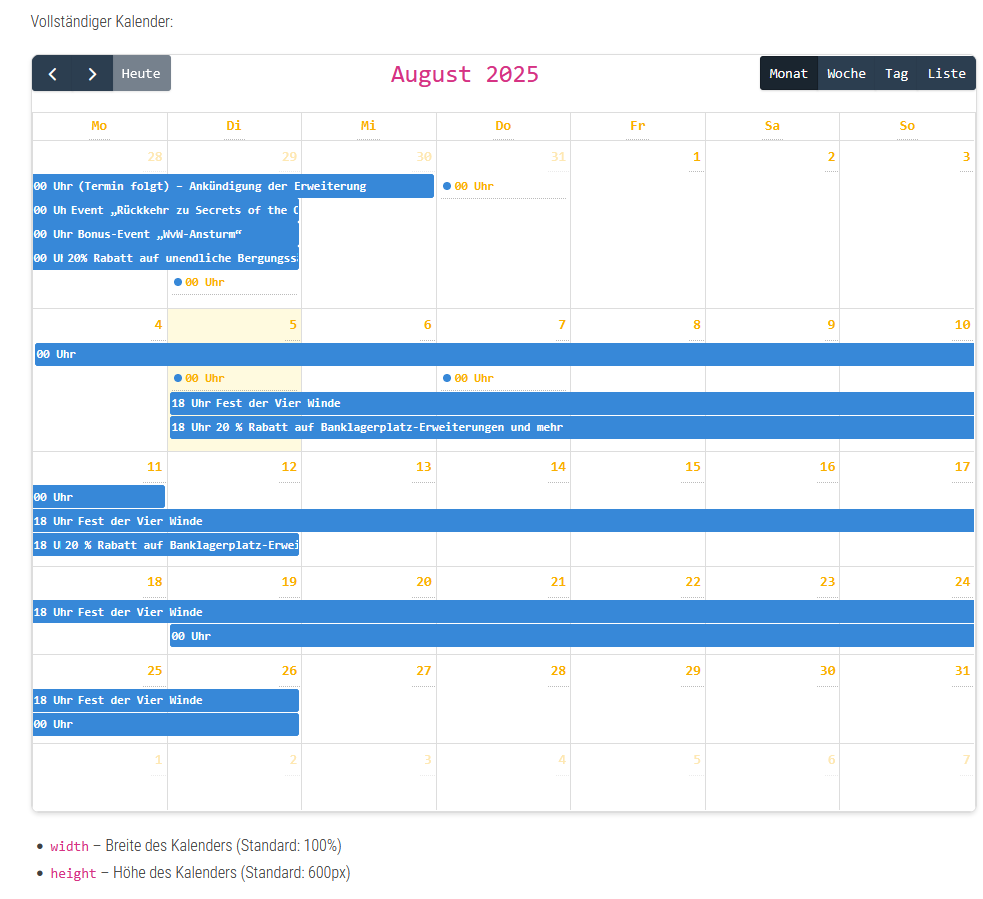

# GW2 Community Calendar Plugin

Ein WordPress-Plugin für die Anzeige von Guild Wars 2 Community Events mit verschiedenen Widget-Shortcodes.

**Version: 1.5.0**

## Features

- **Vollständiger Kalender**: Interaktiver Kalender mit FullCalendar.js
- **Event-Listen**: Verschiedene Listen-Ansichten für Events
- **Countdown-Widgets**: Countdown für spezifische Events
- **Heutige Events**: Anzeige der Events von heute
- **Responsive Design**: Optimiert für alle Geräte
- **Admin-Interface**: Einfache Verwaltung über WordPress Admin

## Screenshots

### Admin-Bereich


### Kalender-Ansicht


### Event-Listen Widget


### Countdown Widget


## Installation

1. Laden Sie das Plugin in Ihr WordPress-Verzeichnis hoch
2. Aktivieren Sie das Plugin in WordPress Admin
3. Gehen Sie zu "Einstellungen > GW2 Kalender"
4. Laden Sie eine ICS-Datei hoch oder konfigurieren Sie den automatischen Download

## Verfügbare Shortcodes

### 1. Vollständiger Kalender
```php
[gw2_calendar]
```

**Parameter:**
- `width` - Breite des Kalenders (Standard: 100%)
- `height` - Höhe des Kalenders (Standard: 600px)

**Beispiel:**
```php
[gw2_calendar width="800px" height="500px"]
```

### 2. Event-Liste
```php
[gw2_events_list]
```

**Parameter:**
- `limit` - Anzahl der Events (Standard: 10)
- `show_date` - Datum anzeigen (Standard: true)
- `show_time` - Zeit anzeigen (Standard: true)
- `show_location` - Ort anzeigen (Standard: true)
- `show_description` - Beschreibung anzeigen (Standard: false)
- `css_class` - CSS-Klasse für das Container-Element (Standard: gw2-events-list)
- `debug` - Debug-Informationen anzeigen (Standard: false)

**Beispiel:**
```php
[gw2_events_list limit="5" show_description="true"]
```

**Debug-Beispiel:**
```php
[gw2_events_list debug="true"]
```

### 3. Nächste Events
```php
[gw2_next_events]
```

**Parameter:**
- `count` - Anzahl der Events (Standard: 5)
- `days_ahead` - Tage in die Zukunft (Standard: 30)

**Beispiel:**
```php
[gw2_next_events count="3" days_ahead="14"]
```

### 4. Event Countdown
```php
[gw2_event_countdown]
```

**Parameter:**
- `event_id` - Spezifische Event-ID (Standard: nächstes Event)

**Beispiel:**
```php
[gw2_event_countdown event_id="event123"]
```

### 5. Heutige Events
```php
[gw2_today_events]
```

**Parameter:**
- `show_time` - Zeit anzeigen (Standard: true)
- `show_location` - Ort anzeigen (Standard: true)

**Beispiel:**
```php
[gw2_today_events show_location="false"]
```

## Widget-Verwendung

### Sidebar-Widgets
Alle Shortcodes können in WordPress-Widgets verwendet werden:

1. Gehen Sie zu "Darstellung > Widgets"
2. Fügen Sie ein "Text"-Widget hinzu
3. Fügen Sie den gewünschten Shortcode ein

### Seiten und Beiträge
Fügen Sie Shortcodes direkt in Seiten oder Beiträge ein:

```php
<!-- Vollständiger Kalender -->
[gw2_calendar]

<!-- Event-Liste für Sidebar -->
[gw2_events_list limit="5" show_description="false"]

<!-- Countdown für nächstes Event -->
[gw2_event_countdown]

<!-- Heutige Events -->
[gw2_today_events]
```

## Admin-Konfiguration

### Kalender-Verwaltung
- **Manueller Download**: Laden Sie ICS-Dateien direkt hoch
- **Automatischer Download**: Automatischer Download von der GW2-Community
- **Status prüfen**: Überprüfen Sie den Download-Status

### Einstellungen
- **Wochenstart**: Montag oder Sonntag
- **Benutzerdefiniertes CSS**: Anpassung des Aussehens

## CSS-Anpassungen

Das Plugin bietet verschiedene CSS-Klassen für Anpassungen:

```css
/* Event-Liste */
.gw2-events-list { }
.gw2-event-item { }
.gw2-event-title { }

/* Nächste Events */
.gw2-next-events { }
.gw2-next-event-item { }

/* Countdown */
.gw2-event-countdown { }
.gw2-countdown-timer { }

/* Heutige Events */
.gw2-today-events { }
.gw2-today-event-item { }
```

## Troubleshooting

### Events werden nicht angezeigt
1. Prüfen Sie, ob eine ICS-Datei hochgeladen wurde
2. Überprüfen Sie den Download-Status im Admin-Bereich
3. Stellen Sie sicher, dass die ICS-Datei gültig ist

### Kalender lädt nicht
1. Prüfen Sie die Browser-Konsole auf JavaScript-Fehler
2. Stellen Sie sicher, dass FullCalendar.js geladen wird
3. Überprüfen Sie die Netzwerkverbindung

### Styling-Probleme
1. Verwenden Sie das benutzerdefinierte CSS-Feld im Admin
2. Prüfen Sie auf CSS-Konflikte mit dem Theme
3. Testen Sie in einem anderen Browser

## Support

Bei Problemen oder Fragen:
1. Überprüfen Sie die WordPress-Fehlerprotokolle
2. Testen Sie das Plugin in einer sauberen WordPress-Installation
3. Stellen Sie sicher, dass alle Abhängigkeiten verfügbar sind

## Changelog

### Version 1.5.0 (Aktuell)
- **Neue Features:**
  - Mehrere neue Widget-Shortcodes hinzugefügt (`gw2_events_list`, `gw2_next_events`, `gw2_event_countdown`, `gw2_today_events`)
  - Event-ID-Liste im Admin-Bereich für einfache Verwendung des Countdown-Shortcodes
  - Debug-Modus für `gw2_events_list` Shortcode zur Fehlerdiagnose
  - Automatische Filterung der Event-IDs (nur aktuelle und zukünftige Events)
  - Download-URL-Test-Funktion im Admin-Bereich

- **Verbesserungen:**
  - Zwei-Spalten-Layout im Admin-Bereich für bessere Übersichtlichkeit
  - Erweiterte CSS-Styles für alle neuen Widget-Shortcodes
  - Verbesserte ICS-Datei-Parsing-Logik mit Unterstützung für mehrzeilige Felder
  - Explizite UTC-Zeitzonen-Behandlung für zuverlässigere Datums-/Zeit-Anzeige
  - Robuste Sortierung mit DateTime-Objekten statt strtotime()
  - Eindeutige Kalender-IDs für mehrere Kalender-Instanzen auf derselben Seite
  - Responsive Design-Optimierungen für alle Widget-Shortcodes

- **Bugfixes:**
  - Korrektur der ICS-URL von `webcal://` zu `https://` für zuverlässigen automatischen Download
  - Behebung von Datums-Anzeigeproblemen bei zukünftigen Events
  - Korrektur der mehrzeiligen ICS-Feld-Parsing (Faltung)
  - Verbesserte Behandlung von `DTSTART;VALUE=DATE` Format
  - Entfernung des fehlerhaften Click-to-Copy-Features
  - Behebung von Kalender-Anzeigeproblemen bei mehreren Instanzen

- **Entfernte Features:**
  - Mini-Kalender Shortcode entfernt (auf Benutzerwunsch)

### Version 1.1.0
- Neue Widget-Shortcodes hinzugefügt
- Verbesserte CSS-Styles
- Erweiterte Admin-Dokumentation
- Responsive Design-Optimierungen

### Version 1.0.0
- Grundlegende Kalender-Funktionalität
- ICS-Datei-Support
- Admin-Interface
- Vollständiger Kalender-Shortcode

## Lizenz

GPL v2 oder später 